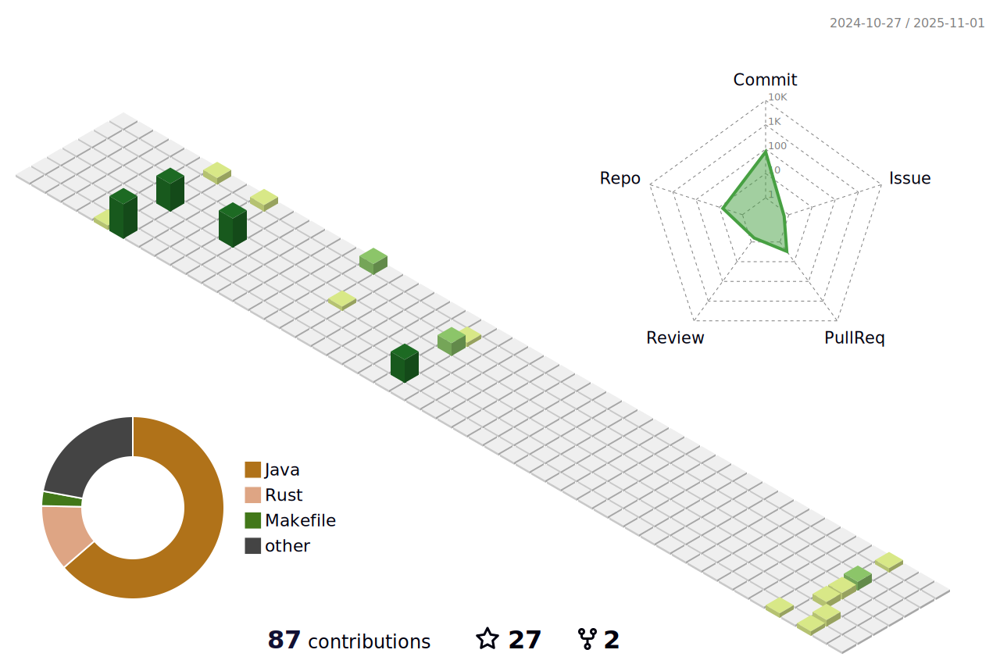

- 👋 Hi, I’m Rudy Ryanto
- 🛠 I'm Senior Software Engineer
- ⚡ I'm currently learning go, python, machine learning.
- 💡  Interest about streaming platform like RedPanda, Kafka, Apache Flink
- 📫 How to reach me :

 
   

<!---
MRdyRy/MRdyRy is a ✨ special ✨ repository because its `README.md` (this file) appears on your GitHub profile.
You can click the Preview link to take a look at your changes.
--->
 
<!---->

- 🐱‍💻 Things that I've used and learned
<table>
<tr>
  <td>Language</td>
  <td>Java, JavaScript, PHP, Python, GO</td>
</tr>
  <tr>
  <td>Framework</td>
  <td>Spring, Springboot, Vaadin, ZK, CodeIgniter, React, React Native, Lumen</td>
</tr>
 <tr>
  <td>SQL</td>
  <td>MySQL, PostgreSQL, IBM DB2, Oracle DB</td>
</tr>
 <tr>
  <td>No-SQL</td>
  <td>Elasticsearch, MongoDB, redis</td>
</tr>
  <tr>
  <td>WS</td>
  <td>REST, SOAP, gRPC</td>
</tr>
  <tr>
  <td>Virtualization</td>
  <td>Docker, OCP, Kubernetes, GCP, Platform.sh</td>
</tr>
<tr>
  <td>Testing</td>
  <td>Mockito, JUnit, Cucumber, Postman, Microcks, Mocklabs</td>
</tr>  
  <tr>
  <td>Monitoring</td>
  <td>ELK, Splunk</td>
</tr>
  <tr>
  <td>Versioning</td>
  <td>GitHub, Gitlab, Bitbucket</td>
</tr>
  <tr>
  <td>Architecture</td>
  <td>Monolith, Microservices</td>
</tr>
  <tr>
  <td>Caching</td>
  <td>Redis, RedHat JBoss Data grid</td>
</tr>
  <tr>
  <td>Data Stream</td>
  <td>RedHat AMQ, Apache Kafka, MQTT</td>
</tr>
   <tr>
  <td>CI/CD</td>
  <td>Jenkins, Gitlab Runner, Github Action (CI) </td>
</tr>
 <tr>
  <td>Pentest</td>
  <td>Burpsuite</td>
 </tr>
<tr>
 <td>Config</td>
 <td>Ansible, Make</td>
</tr>
</table>

<h3 align="left">Support:</h3>

  
